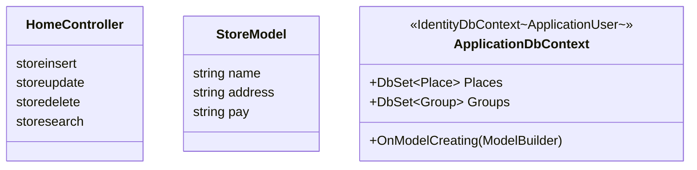
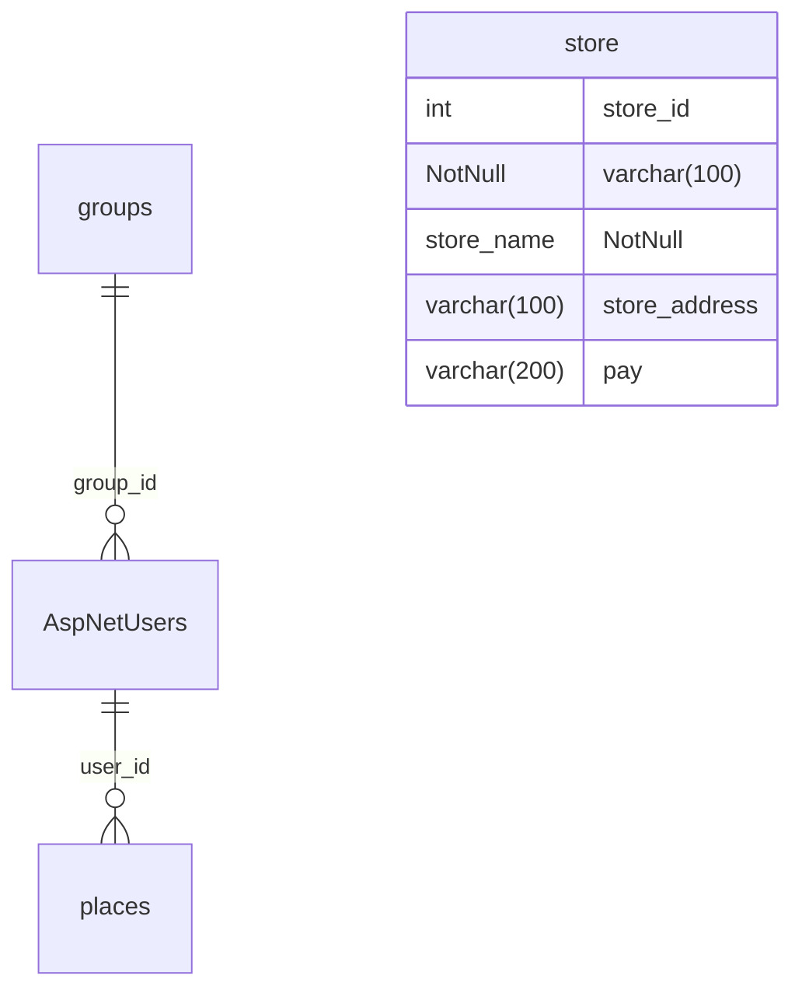

# フィールドワーク共有アプリ 内部設計書

| 項目 | 内容 |
|---|---|
| プロジェクト名 |Loolpay|
| バージョン | 0.1（ドラフト） |
| 作成日 | 2026-05-21 |
| ステータス | レビュー前 |

> 本書は要件定義書 [`要件定義書.md`](../requirements/要件定義書.md) および外部設計書 [`外部設計書.md`](外部設計書.md) を踏まえ、内部実装の構造（クラス図 / 処理フロー / ER 図 / テーブル定義）を整理した内部設計書のドラフトです。

---

## 1. クラス図

### 1.1 モデル / ViewModel / DbContext / コントローラ全体図

### 1.2 クラスの責務

| クラス | 種類 | 責務 |
|---|---|---|
| `ApplicationDbContext` | DbContext | EF Core のコンテキスト。`IdentityDbContext<ApplicationUser>` を継承し、`Places` / `Groups` を追加 |
| `HomeController` | コントローラ | トップ / プライバシー / エラー画面 |
| `StoreModel` | モデル | プロパティ|

---

## 2. 処理フロー

flowchart TD

A[Top画面表示] --> B[編集ボタン押下]

B --> C[入力画面表示]

C --> D[名前・住所・支払方法入力]

D --> E{押下ボタン判定}

E -- 決定 --> F[入力内容を登録]

F --> G[Top画面へ項目追加]

G --> H[Top画面へ戻る]

E -- キャンセル --> I[何も処理しない]

I --> H

https://chatgpt.com/s/m_6a0eac4b2cd4819188a1c866153d28f0

https://chatgpt.com/s/m_6a0ead08490481918ed69b827d57731c

---

## 3. テーブル定義書

### 3.1 ER 図

> ER 図上の `AspNetUsers` は本アプリ固有の拡張カラム（`DisplayName` / `group_id`）と関連キーのみを記載しており、Identity 標準カラム（`UserName` / `Email` / `PasswordHash` 等）は省略している。
> また、Identity 標準のその他テーブル（`AspNetRoles` / `AspNetRoleClaims` / `AspNetUserClaims` / `AspNetUserLogins` / `AspNetUserRoles` / `AspNetUserTokens`）は v0.1 で未使用のため省略する。仕様の詳細は [ASP.NET Core Identity の公式ドキュメント](https://learn.microsoft.com/aspnet/core/security/authentication/identity) を参照。

### 3.2 テーブル定義

#### 3.2.1 `store`

| カラム | 型 | NULL | デフォルト | 説明 |
|---|---|---|---|---|
| store_id | integer | NOT NULL | identity | 主キー |
| store_name | character varying(100) | NOT NULL | – | グループ名 |
| store_address | character varying(100) |  | – | グループ名 |
| pay | character varying(200) |  | – | グループ名 |

- **主キー**: `id`
- **インデックス**: なし（PK のみ）

### 3.3 マイグレーション履歴

| マイグレーション | 内容 |
|---|---|
| `20260409082215_InitialCreate` | `places` テーブル新規作成 |
| `20260414062254_AddPlaceCoordinates` | `places` に `latitude` / `longitude` カラム追加 |
| `20260414063838_AddIdentityAndGroups` | Identity 標準テーブル群 + `groups` 追加、`AspNetUsers` に `DisplayName` / `group_id` 拡張、`places.user_id` 追加 |
| `20260414081229_AddPlaceImage` | `places` に `image_file_name` カラム追加 |

---

## 改訂履歴

| 改定日 | バージョン | 改訂者 | 改定箇所 | 改定内容 |
|---|---|---|---|---|
| 2026-05-21 | 0.1 | 佐久川雄多 | – | 初版作成（クラス図 / 処理フロー / ER 図 / テーブル定義） |

