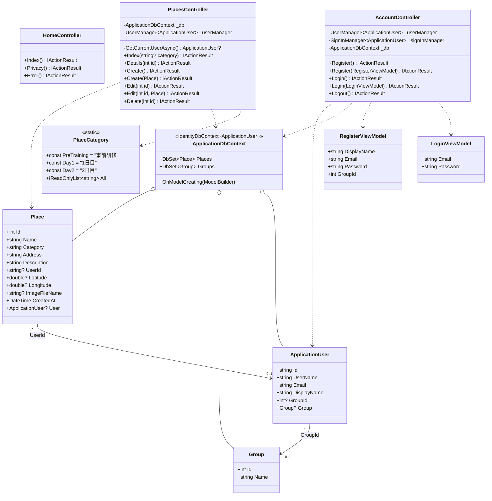
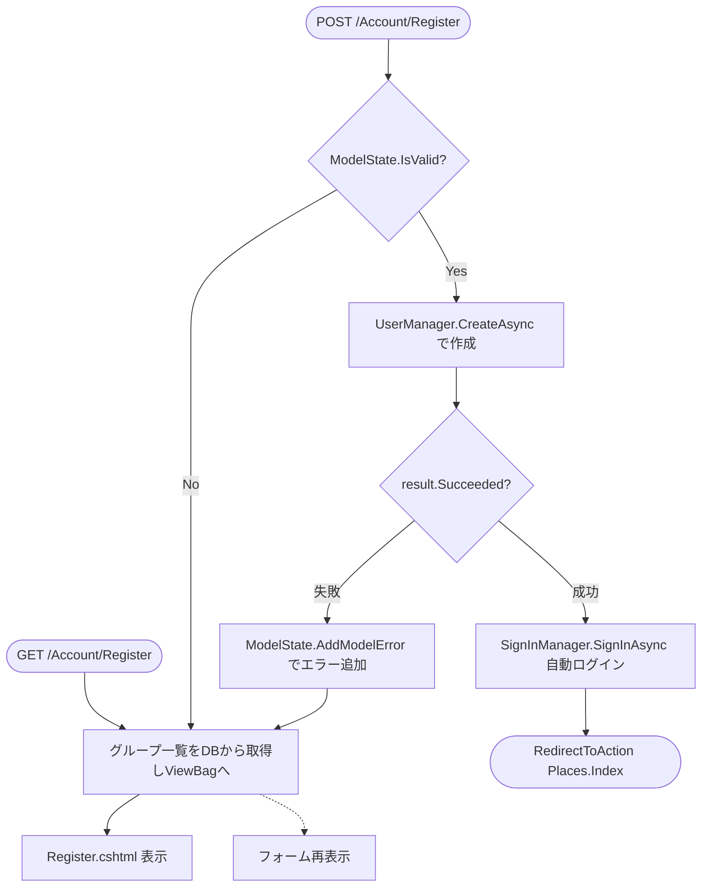
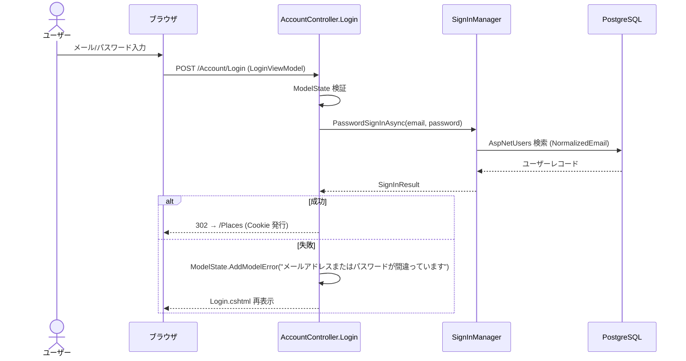
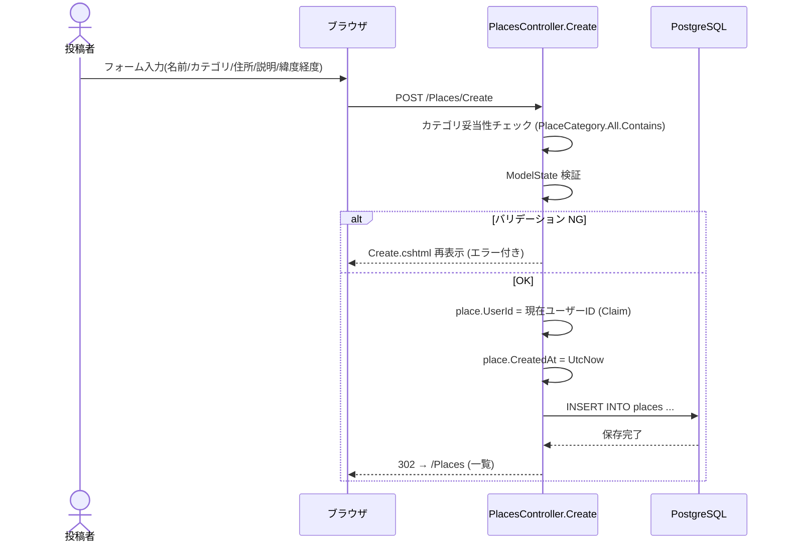
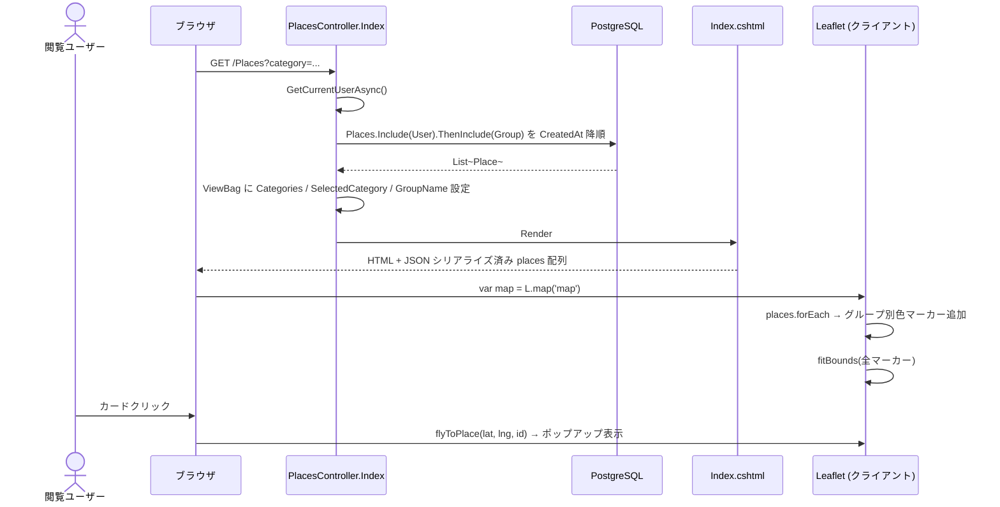
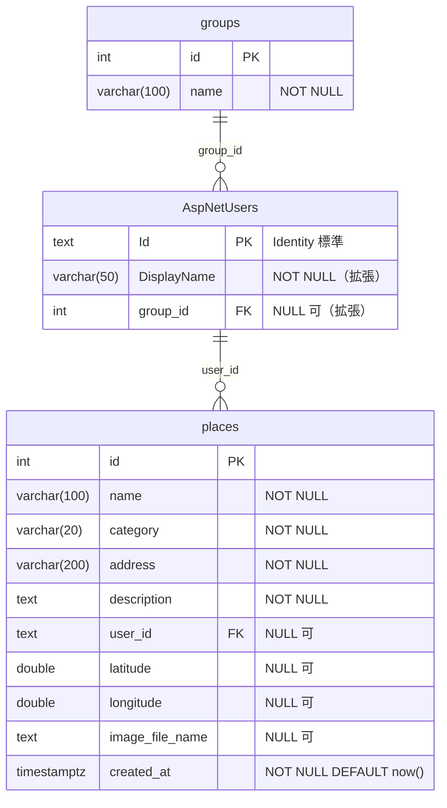

# フィールドワーク共有アプリ 内部設計書（ドラフト）

| 項目 | 内容 |
|---|---|
| プロジェクト名 | MyFirstWebApp（フィールドワーク共有アプリ） |
| バージョン | 0.1（ドラフト） |
| 作成日 | 2026-05-01 |
| ステータス | レビュー前 |

> 本書は要件定義書 [`要件定義書.md`](../requirements/要件定義書.md) および外部設計書 [`外部設計書.md`](外部設計書.md) を踏まえ、内部実装の構造（クラス図 / 処理フロー / ER 図 / テーブル定義）を整理した内部設計書のドラフトです。

---

## 1. クラス図

### 1.1 モデル / ViewModel / DbContext / コントローラ全体図



### 1.2 クラスの責務

| クラス | 種類 | 責務 |
|---|---|---|
| `ApplicationUser` | Identity ユーザー（拡張） | `IdentityUser` を継承。`DisplayName`、`GroupId`（ナビゲーション `Group`）を追加 |
| `Group` | エンティティ | グループ（ID / 名前）を表現 |
| `Place` | エンティティ | 投稿された場所。投稿者 (`UserId`) は `ApplicationUser` への FK |
| `PlaceCategory` | 静的定数 | カテゴリの定数定義と全件リスト（`All`） |
| `LoginViewModel` | ViewModel | ログインフォーム入力（Email / Password） |
| `RegisterViewModel` | ViewModel | 登録フォーム入力（DisplayName / Email / Password / GroupId） |
| `ApplicationDbContext` | DbContext | EF Core のコンテキスト。`IdentityDbContext<ApplicationUser>` を継承し、`Places` / `Groups` を追加 |
| `HomeController` | コントローラ | トップ / プライバシー / エラー画面 |
| `AccountController` | コントローラ | 登録 / ログイン / ログアウト |
| `PlacesController` | コントローラ | 場所の CRUD（投稿 / 一覧 / 詳細 / 編集 / 削除） |

---

## 2. 処理フロー

### 2.1 ユーザー登録（F-01）



### 2.2 ログイン（F-02）



### 2.3 場所投稿（F-07）



### 2.4 場所編集・削除（F-08 / F-09）

```mermaid
flowchart TD
    Req([POST /Places/Edit/{id} or Delete/{id}])
    GetUser[現在ユーザー取得 GetCurrentUserAsync<br/>UserManager.Users.Include Group]
    LoadPlace[Place を Include User で取得]
    Exists{Place 存在?}
    NotFound([NotFound 404])
    GroupCheck{place.User.GroupId == user.GroupId?}
    Forbid([Forbid 403])
    Op[編集: フィールド更新 / 削除: Remove]
    Save[SaveChangesAsync]
    Redirect([RedirectToAction Index])

    Req --> GetUser --> LoadPlace --> Exists
    Exists -- No --> NotFound
    Exists -- Yes --> GroupCheck
    GroupCheck -- No --> Forbid
    GroupCheck -- Yes --> Op --> Save --> Redirect
```

### 2.5 場所一覧 + 地図表示（F-04 / F-10）



---

## 3. テーブル定義書

### 3.1 ER 図



> ER 図上の `AspNetUsers` は本アプリ固有の拡張カラム（`DisplayName` / `group_id`）と関連キーのみを記載しており、Identity 標準カラム（`UserName` / `Email` / `PasswordHash` 等）は省略している。
> また、Identity 標準のその他テーブル（`AspNetRoles` / `AspNetRoleClaims` / `AspNetUserClaims` / `AspNetUserLogins` / `AspNetUserRoles` / `AspNetUserTokens`）は v0.1 で未使用のため省略する。仕様の詳細は [ASP.NET Core Identity の公式ドキュメント](https://learn.microsoft.com/aspnet/core/security/authentication/identity) を参照。

### 3.2 テーブル定義

#### 3.2.1 `groups`

| カラム | 型 | NULL | デフォルト | 説明 |
|---|---|---|---|---|
| id | integer | NOT NULL | identity | 主キー |
| name | character varying(100) | NOT NULL | – | グループ名 |

- **主キー**: `id`
- **インデックス**: なし（PK のみ）

#### 3.2.2 `AspNetUsers`（拡張カラムのみ）

> Identity 標準カラム（`Id` / `UserName` / `Email` / `PasswordHash` / `SecurityStamp` 等）は ASP.NET Core Identity の仕様に従うため本書では割愛し、本アプリで追加した拡張カラムのみを記載する。

| カラム | 型 | NULL | 説明 |
|---|---|---|---|
| DisplayName | character varying(50) | NOT NULL | 画面表示用の名前（拡張） |
| group_id | integer | NULL | 所属グループ FK（`groups.id`）（拡張） |

- **拡張インデックス**: `IX_AspNetUsers_GroupId`（on `group_id`）
- **拡張外部キー**: `group_id` → `groups.id`（ON DELETE: NO ACTION）

#### 3.2.3 `places`

| カラム | 型 | NULL | デフォルト | 説明 |
|---|---|---|---|---|
| id | integer | NOT NULL | identity | 主キー |
| name | character varying(100) | NOT NULL | – | 場所の名前 |
| category | character varying(20) | NOT NULL | – | カテゴリ（`PlaceCategory.All` のいずれか） |
| address | character varying(200) | NOT NULL | – | 住所 |
| description | text | NOT NULL | – | メモ |
| user_id | text | NULL | – | 投稿者 FK（`AspNetUsers.Id`） |
| latitude | double precision | NULL | – | 緯度（地図ピン用） |
| longitude | double precision | NULL | – | 経度（地図ピン用） |
| image_file_name | text | NULL | – | 写真ファイル名（実装中） |
| created_at | timestamp with time zone | NOT NULL | `now()` | 投稿日時（DB 側で自動付与） |

- **主キー**: `id`
- **インデックス**:
  - `IX_places_UserId`（on `user_id`）
- **外部キー**:
  - `user_id` → `AspNetUsers.Id`（ON DELETE: NO ACTION、NULL 許容）

### 3.3 マイグレーション履歴

| マイグレーション | 内容 |
|---|---|
| `20260409082215_InitialCreate` | `places` テーブル新規作成 |
| `20260414062254_AddPlaceCoordinates` | `places` に `latitude` / `longitude` カラム追加 |
| `20260414063838_AddIdentityAndGroups` | Identity 標準テーブル群 + `groups` 追加、`AspNetUsers` に `DisplayName` / `group_id` 拡張、`places.user_id` 追加 |
| `20260414081229_AddPlaceImage` | `places` に `image_file_name` カラム追加 |

---

## 改訂履歴

| 改定日 | バージョン | 改訂者 | 改定箇所 | 改定内容 |
|---|---|---|---|---|
| 2026-05-01 | 0.1 | 担当者 | – | 初版作成（クラス図 / 処理フロー / ER 図 / テーブル定義） |
| 2026-05-15 | 0.1.1 | 担当者 | 3.1 ER 図 / 3.2.2 AspNetUsers | Identity 標準カラムを省略し、拡張カラム（`DisplayName` / `group_id`）のみに簡略化 |
