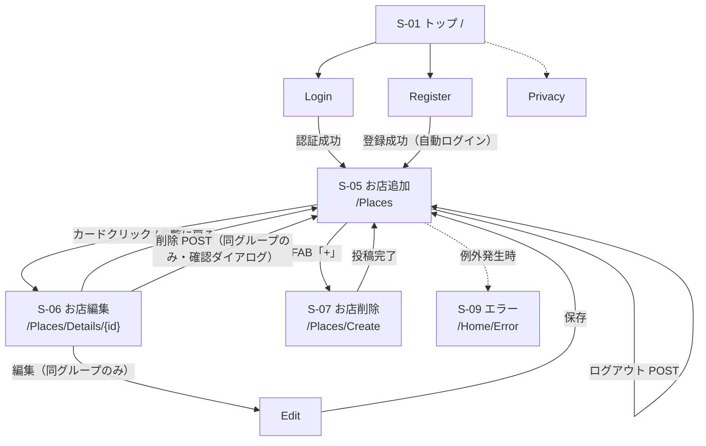

# フィールドワーク共有アプリ 外部設計書（ドラフト）

| 項目 | 内容 |
|---|---|
| プロジェクト名 |Loolpay|
| バージョン | 0.1（ドラフト） |
| 作成日 | 2026-05-21 |
| ステータス | レビュー前 |

> 本書は要件定義書 [`要件定義書.md`](../requirements/要件定義書.md) を踏まえ、現状の実装に基づいて外部から見える画面・機能・遷移を整理した外部設計書のドラフトです。

---

## 1. 画面一覧

### 1.1 画面（GET でビューを返すもの）

| ID | 画面名 | URL | コントローラ.アクション | 認証 | 概要 |
|---|---|---|---|---|---|
| S-01 | トップ | `/` | `PlacesController.Index` | 不要 | アプリのトップページ（要差し替え：現状は ASP.NET 既定の Welcome 表示） |
| S-02 | お店追加 | `/Places/Create` | `PlacesController.Create` (GET) | 不要 | 名前 / 住所 / 支払方法 |
| S-03 | お店削除 | `/Places/Delete` | `PlacesController.Edit` (GET) | 不要 | 既存場所の編集（同グループのみ） |
| S-04 | お店編集 | `/Places/Edit` | `PlacesController.Edit` (GET) | 不要 | 既存場所の削除（同グループのみ） |
| S-05 | エラー | `/Home/Error` | `HomeController.Error` | 不要 | 例外発生時のエラー画面 |

### 1.2 画面を持たない POST アクション

| アクション | URL | トリガー | 概要 |
|---|---|---|---|
| 場所削除 | `POST /Places/Delete/{id}` | S-06 詳細画面の削除ボタン | 確認ダイアログ後に削除し `/Places` へリダイレクト |

---

## 2. 画面遷移図

> 認証を要する画面（S-05〜S-08）に未ログインでアクセスした場合は、ASP.NET Core Identity の標準動作によりログイン画面（S-04）にリダイレクトされる。

---

## 3. 各画面ワイヤーフレーム概要

> 本節は構成要素の概要のみを記載する。レイアウト詳細・配色・余白等は後ほど確定する。

### S-01 トップ
- アプリ紹介とログイン / 新規登録への導線
- ヘッダー：アプリ名、検索バー
- メイン：お店の表示　最終更新日の表示
- アクション：お店追加、編集、削除
- プルダウン:言語変更（日本語と英語対応）

### S-07 お店追加
- フォーム要素：名前 / 住所
- 画像挿入:該当店舗の画像を選択
- チェックボックス:支払い方法
- アクション：`キャンセル`（一覧へ戻る）/ `追加する`

### S-08 お店編集
- レイアウトは お店追加 と同等。
- アクション：`キャンセル` / `保存`

### S-08 お店削除
- テキスト　:「このお店を削除してもよろしいですか？」
- アクション：`キャンセル` / `削除`

### S-09 エラー
- エラーメッセージ /トップへのリンク

---

## 4. 機能一覧

### 4.1 機能要件

| ID | 機能名 | 関連画面 | 概要 | 認証 | 権限 |
|---|---|---|---|---|---|
| F-04 | お店一覧 | S-01 | 全お店を追加された順で表示 | 不要 | 全グループ閲覧可 |
| F-05 | お店検索 | S-01 | お店を検索 | 要 | 全グループ |
| F-07 | お店追加 | S-02 | 名前 / 住所 / 支払方法/画像などの情報を入力 | 不要 | 全グループ |
| F-08 | お店編集 | S-04 | 既存のお店の上書き保存 | 不要 | 全グループ |
| F-09 | お店削除 | S-03 から POST | 既存のお店の削除 | 不要 | 全グループ |
| F-09 | 言語変更 | S-03 から POST | 本システムの一部該当場所の言語を変更 | 不要 | 全グループ |

### 4.2 カテゴリ一覧

`PlaceCategory.All` で定義（フィールドワーク向け）：

- 事前研修
- 1日目
- 2日目

### 4.3 権限ルール

| 操作 | 権限 |
|---|---|
| 場所の閲覧（一覧 / 詳細 / 地図） | ログインユーザーは全グループ分を閲覧可 |
| 場所の投稿 | ログインユーザーが自身の所属グループとして投稿 |
| 場所の編集・削除 | 投稿者と **同じグループに所属するユーザー** のみ可（個人単位ではなくグループ単位） |

---

## 改訂履歴

| 改定日 | バージョン | 改訂者 | 改定箇所 | 改定内容 |
|---|---|---|---|---|
| 2026-05-21 | 0.1 | 上原綾真 | – | 初版作成（画面一覧 / 画面遷移図 / ワイヤーフレーム概要 / 機能一覧） |
| 2026-05-22 | 0.1 | 上原綾真 | – | 支払い方法の情報挿入を入力からチェックボックスへ変更、異なる内容の修正 |
| 2026-05-25 | 0.1 | 上原綾真 | – | 追加機能による追加記述(機能要件/ワイヤーフレーム概要) |